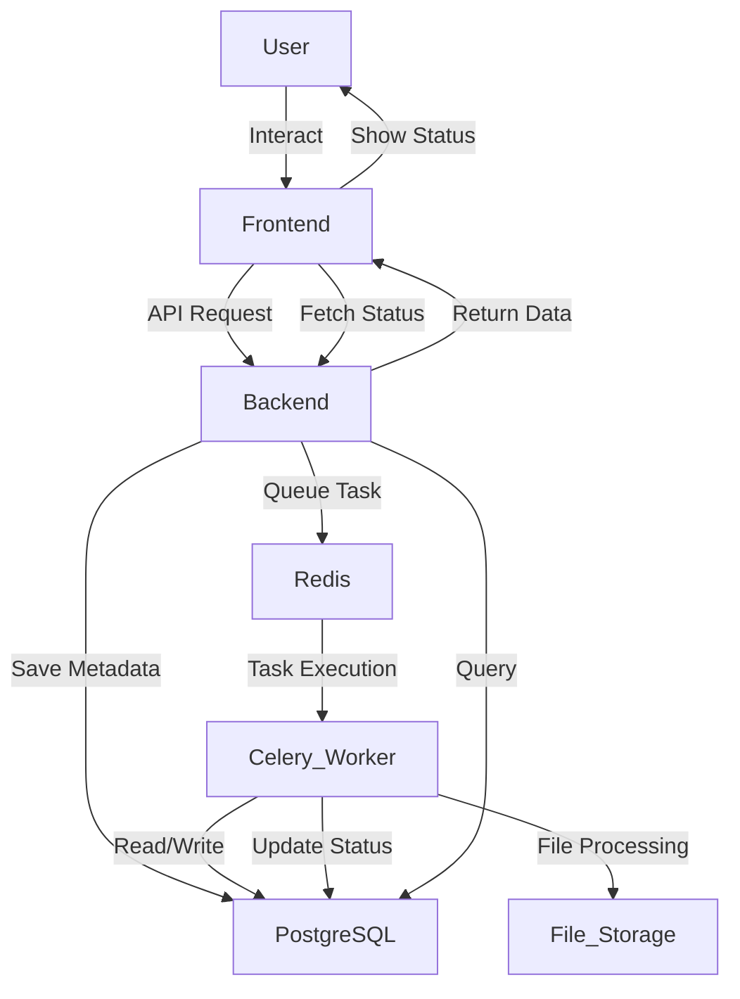

# **File Management System with Microservices**

This project provides a microservice-based file management system. Users can upload PDF files, track processing statuses, and view parsed content on the frontend. The system uses **FastAPI** as the backend, **React** for the frontend, **Celery** for asynchronous tasks, and **PostgreSQL** as the database.

---

## **Table of Contents**
1. [System Architecture](#system-architecture)
2. [Features](#features)
3. [How to Set Up Development Environment](#how-to-set-up-development-environment)
4. [How to Reproduce This Project](#how-to-reproduce-this-project)
5. [Helpful Notes for Understanding This Project](#helpful-notes-for-understanding-this-project)

---

## **System Architecture**

The following diagram illustrates the system architecture:



# Features
- **Upload PDF Files**: Users can upload PDF files for processing.
- **Track Status**: File statuses include Uploading, Parsing, Completed, and Failed.
- **View Content**: Users can view the parsed content of processed files.
- **Pagination**: Display up to 20 records per page with pagination support.
- **Auto Updates**: The frontend periodically polls the backend to update file processing statuses.

---

# How to Set Up the Development Environment

## 1. Prerequisites
Ensure the following tools are installed on your system:
- Docker and Docker Compose
- Python (>=3.9) and Node.js (>=16)
- PostgreSQL

## 2. Clone the Project
```bash
git clone https://github.com/trentgood0727/Uploader-DataParsing-FastAPI.git
cd Uploader-DataParsing-FastAPI
```

## 3. Configure Environment Variables

Create a `.env` file in the project root with the following content:

```env
# Database credentials
POSTGRES_USER=admin
POSTGRES_PASSWORD=123456
POSTGRES_DB=file_upload_db
TZ=Asia/Taipei

# DB URL
DATABASE_URL=postgresql://admin:123456@db/file_upload_db
```

## 4. Initialize the Database

Follow these steps to initialize the database:

### If running PostgreSQL locally:
```bash
psql -U postgres
CREATE DATABASE file_upload_db;
ALTER DATABASE file_upload_db SET timezone TO 'Asia/Taipei';
\q
```

## 5. Install Dependencies

### Backend
```bash
cd backend
python -m venv venv
source venv/bin/activate
pip install -r requirements.txt
```
### Frontend
```bash
cd frontend
npm install
```

## 6. Running the Services Locally

### Backend
```bash
cd backend
uvicorn app.main:app --host 0.0.0.0 --port 8000 --reload
```

### Frontend
```bash
cd frontend
npm start
```

### Celery Worker
```bash
cd backend
celery -A app.tasks worker --loglevel=info
```

### Redis (via Docker)
```bash
docker run -d --name redis -p 6379:6379 redis
```

# How to Set Up the Development Environment

## 1. Start Docker Compose
Run the following command from the root directory:
```bash
cd Uploader-DataParsing-FastAPI 
docker-compose up --build
```

## 2. Access the Application
- Open the frontend at http://localhost:3000.
- Use the file upload feature to start testing.

## 3. esting Parsing
- Upload a PDF file. Use the backend logs (docker logs backend) and Celery worker logs (docker logs celery_worker) to track file parsing progress.

## 4. Monitor Database
Access the PostgreSQL database:
```bash
docker exec -it <db-container-name> psql -U postgres
\c file_upload_db
SELECT * FROM file_records;
SELECT * FROM parsed_content;
```

# Notes for Understanding the Work

## 1. How It Works
- Frontend:
	- Built with React, it displays file records with automatic status polling.
	- Allows users to upload files, view parsing results, and delete records.
- Backend:
	- FastAPI handles file upload and interacts with the PostgreSQL database.
	- Uses Celery for asynchronous PDF parsing.
- Database:
	- file_records stores metadata for uploaded files.
	- parsed_content stores the extracted content.
- Asynchronous Tasks:
	- Celery workers offload parsing tasks to improve scalability.

## 2. Known Issues
- Parsing Errors: Ensure uploaded files are valid PDFs.
- Timezone: Ensure the PostgreSQL timezone matches FastAPI’s timezone settings.
